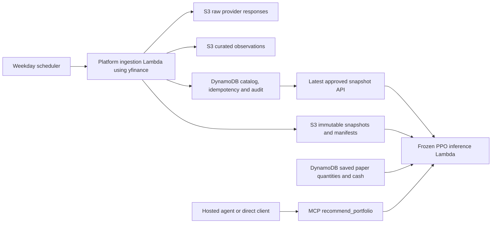

# Beta agent and direct MCP stress verification

Verified 2026-10-10T11:41:45.653552+02:00 (Europe/Rome). This is a bounded functional/concurrency test,
not a production capacity test or evidence of investment performance.

## Failure found and fixed

The initial daily recommendation invoked PPO correctly. However, the plain same-session follow-up
`Why is this your recommendation?` made **zero MCP calls**, used a model response from conversation
history, and had 3 figures removed by claim checking. `Explain the recommendation you just gave me.`
had the same defect. Native remote MCP resource/prompt lists were empty and the tool description
contained no exported recommendation skill. The negative-input stress case also revealed that
AWS Gateway schema validation was misclassified as a retryable dependency failure. The MCP client
now preserves that failure as nonretryable VALIDATION_FAILED, while other service errors remain
dependency errors and producer error envelopes retain their codes.

Beta release `rel_01M4JJEGR1DTSJH6DQ3P0EJWC9`, source `50858b85551c9096ffd96a8b8a22f8e5fcf54938`, fixes both issues through the
existing FinanceAgent pipeline and contracts 1.3.0. No Model/Tools/Platform code release, new tool
target, IAM expansion, retraining or strategy change was required. The full offline suite passed
420 checks, targeted lint passed, the full synthesized infrastructure passed gates, and the beta
pipeline's authenticated integration suite passed, including a real same-session why test.

## What the two paths do

| Path | Backend calls | Output and responsibility |
|---|---|---|
| Hosted daily recommendation | AgentCore Runtime → MCP Gateway → recommend_portfolio → frozen-policy Lambda | Complete prose/table, cash, paper-state label, policy/data provenance, claim check and skill trace |
| Hosted why/explain follow-up | MCP recommend_portfolio pinned to the prior snapshot/date and original portfolio context, then query_market_data for the same session | Fresh reproduction check and mechanical explanation of each trade; changed/unavailable evidence fails explicitly |
| Direct MCP | Authenticated Gateway tools/list and tools/call, without invoking AgentCore Runtime | Raw validated JSON with exactly the same allocations, shares, cash and provenance; the client follows the discovered recipe and supplies presentation |

The hosted `answer.recommendation` matched the direct MCP recommendation exactly. Both hosted
question types used zero Bedrock invocations after the fix. LangGraph adds orchestration, session
anchoring, deterministic presentation and claim checking; it does not supply a different investment
opinion. A direct Codex client can summarize the same data in its own words.

For example, my direct-client summary of the raw result is:

> For the saved paper portfolio, PPO targets GOOGL at 22.82% of capital,
> proposing a purchase of 0.8085 shares (USD 281.58).
> It proposes selling 0.4481 NVDA shares (USD 103.29),
> alongside the other reductions below, and retaining USD 413.05 cash.
> These trades move existing holdings toward learned, state-conditioned targets. They do not
> establish which individual feature or news story caused the network to choose those targets.

The hosted answer presents the complete table below, reference prices, reproducibility identifiers,
limitations and figure checking. This direct summary is my presentation of the raw tool evidence,
not another policy run or an independent forecast.

## Live cases

| Hosted case | Observed latency | MCP tools | Bedrock invocations |
|---|---|---|---:|
| hosted-daily-after | 15.834 s | recommend_portfolio | 0 |
| hosted-why-after | 15.740 s | recommend_portfolio, query_market_data | 0 |
| hosted-explain-after | 15.779 s | recommend_portfolio, query_market_data | 0 |
| hosted-google-after | 15.740 s | recommend_portfolio | 0 |
| hosted-nvidia-after | 34.686 s | recommend_portfolio | 0 |
| hosted-no-context-after | 2.228 s | No tools: requests missing context | 0 |

Six direct recommendation calls at maximum concurrency **3** returned
identical results. Their observed latency range was **13.503–32.604 seconds**.
Direct replay using the original snapshot/date/portfolio also matched exactly. Direct market-data
reads returned approved real-provider evidence. Incomplete holdings and a future decision date
returned expected `VALIDATION_FAILED` errors. A why question in an empty session requested the
missing context without tools, model calls or invented figures.

All successful recommendation/explanation responses passed quantity, notional and cash arithmetic,
retained all five instruments, and passed figure checks without removed figures or thinking markup.
Each recorded the applied skill in `answer.skills_used` and a `skill_selected` stream event.
Local regressions additionally cover changed saved-state revisions, changed policy artifacts,
unavailable market evidence and original explicit holdings.

## Recorded policy result

Saved paper portfolio: revision `1`, initial USD 10,000 equal weight; market session
`2026-10-08`; approved snapshot `snap_01M4G3BWYX7WRADXCS33PEZH35`. These are indicative fractional
share changes at reference closes, before execution prices, rounding and costs. No trades executed.

| Instrument | Action | Current shares | Change | Target shares | Value change USD | Target weight |
|---|---|---:|---:|---:|---:|---:|
| AAPL | sell | 5.8751 | -0.0654 | 5.8097 | -22.27 | 19.78% |
| GOOGL | buy | 5.7423 | +0.8085 | 6.5508 | +281.58 | 22.82% |
| NFLX | sell | 27.9447 | -4.8391 | 23.1056 | -346.33 | 16.54% |
| NVDA | sell | 8.6775 | -0.4481 | 8.2294 | -103.29 | 18.97% |
| VOO | sell | 2.8118 | -0.3132 | 2.4987 | -222.75 | 17.77% |

Current cash: USD 0.00; target cash: USD 413.05
(4.13%). Saved holdings remained unchanged. The frozen policy remains PPO
seeds [0, 1, 2, 3, 4], `mean_target_weights`, configuration `cfg_c7f9f9249b453712d61229ec6d468067e2a629dfc88c407f6a42b853a3425acb`,
export `run_01M4G3X3HJKG2WD3DKEZ3C51SD` and artifact `sha256:2e922b07194c6ab51da2c74d34b70667bb1b3351867cc3e692ee1b6e48c61ccb`.
No calibrated return forecast or neural feature-level causal attribution is available.

## Skills through remote MCP

Applied recipe: **recommend-portfolio 0.2.0**; instruction checksum
`sha256:0a33de78b6869ee51b1be48c1129e44881a9d513a7b143f829aa77e99aa1c5c2`. The complete instruction text and checksum in the remote
`recommend_portfolio` description matched the hosted package exactly. Direct clients discovered it
through authenticated MCP `tools/list` and called the tools themselves, bypassing LangGraph.

A skill is an instruction recipe, rather than a separately callable allocation algorithm. The
current Gateway still returns empty native `resources/list` and `prompts/list`; the recipe is
exported inside the tool description, an existing MCP interface supported by
[AWS ToolDefinition](https://docs.aws.amazon.com/bedrock-agentcore-control/latest/APIReference/API_ToolDefinition.html).
No new target or permission is needed. The current CI identity sees 13 authorized tools; caller
roles determine the visible catalog. This does not complete personal browser/client onboarding
or claim that the separate performance/sensitivity/recommendation-change workflows are fully accepted.

## Where baseline data comes from

CI/CD deploys the ingestion service and its schedules. **EventBridge Scheduler**, rather than a
new CI/CD deployment each morning, runs both the SPY and five-instrument universe ingestion at
**09:00 America/New_York, Monday–Friday** (currently 15:00 Europe/Rome). It targets the most recent
completed exchange session. It is a completed-daily-data workflow, not an intraday quote service.

Only ingestion calls yfinance. The recommendation tool reads the saved paper book and the latest
approved snapshot; FinanceModel verifies stored payload checksums, uses adjusted historical prices
for the frozen actor features, and raw closes for share valuation. The book's initial equal weights
were explicitly approved by the user; market observations are real-provider data, while the book
is hypothetical. Recommendations do not pull actual brokerage holdings or apply proposed trades.

Evidence: both deployed schedules are enabled; Friday October 9 invocations at 15:00 Europe/Rome
completed; the dead-letter queue has zero visible/in-flight messages. Replaying the Friday universe
scheduled event returned the same approved snapshot, with trigger `scheduled`, coverage
`2010-10-01` through `2026-10-08`,
and unchanged saved revision. This exercised idempotent delivery without duplicating the snapshot.
MCP market-data reads reported provider `yfinance`, library
`1.7.0`, and retrieval timestamp
`2026-10-09T10:29:29Z`. No ingestion invocation occurred during the
acceptance recommendation requests, confirming that they consumed stored data.

Latest approved session remains October 8: Friday's pre-open schedule targets Thursday's close,
there is no weekend ingestion schedule, and the optional Friday-close refresh returned missing
closing prices and was rejected. The agent discloses the actual completed session. No validation
was relaxed or market prices fabricated. One operator audit retry corrected the test helper's
scheduled-response envelope decoding; both attempts are included in costs.

## Isolation and cost

Conservative incremental AWS estimate: **USD 0.4020**, within
the USD 2 test/fix cap and USD 50 project budget. This includes 10
CodeBuild runs (20 rounded minutes),
26 CodePipeline action minutes, and a USD 0.25 allowance
for Lambda, AgentCore, storage, logs and the small initial model calls. No processing or training
jobs were created. AWS Budgets reports USD 7.6490; billing may lag.
The preceding saved-paper rollout remains separately recorded at USD 0.8825, with its earlier
serving/export round separately recorded at USD 1.2562.

All eight Gamma/prod manifests and release-parameter write timestamps are unchanged; selected
strategy and research references are unchanged. The owned pipeline execution is stopped before
Gamma, original transition states are restored, and no round build or compute job remains active.

See [agent-api.md](agent-api.md), [beta-access.md](beta-access.md) and the prior
[saved-paper verification](beta-saved-portfolio-verification.md). Raw authenticated responses and
sanitized audit receipts are retained locally outside version control; credentials are not included.
