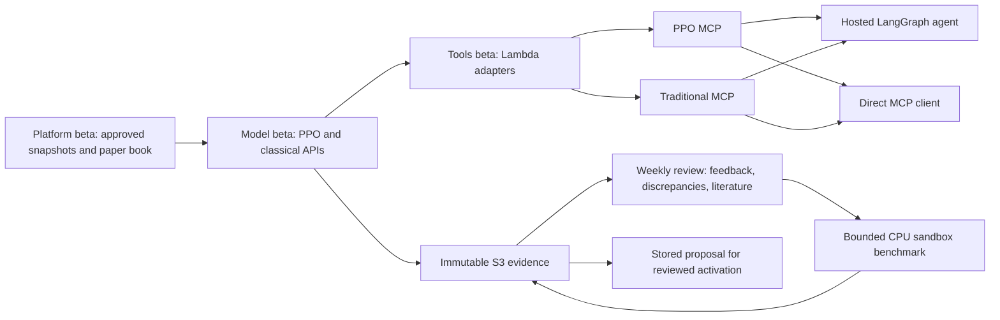

# Beta traditional portfolio MCP verification

The beta hosted LangGraph agent can use the existing PPO MCP and a separate traditional portfolio MCP. Traditional tools support minimum variance, mean variance and scenario CVaR, with immutable decision evidence and three levels of explanation. The weekly research controller benchmarks supported configurations and stores a proposal for review.

Cost and environment audited at **2026-10-10 12:45:57.630464+00:00**. Every final pipeline beta action passed; all owned executions are terminal and original transition states are restored. Gamma/prod actions and manifests stayed unchanged, the PPO serving references stayed unchanged, and the weekly run preserved the paper book.

| Pipeline | Deployed beta release | Deployed source commit |
|---|---|---|
| financialplanning | `rel_01M4JQXZWEYZPZWG70CHRNCW7Y` | `98d79a70b38c23f0c1b3636cc06e7bbed28df137` |
| financemodel | `rel_01M4JWFD3MFS5DERNCC657XX0M` | `6b49e49019ca1916da06de2d2247072721920d97` |
| financelambdastool | `rel_01M4JPNNW5EXCEGRJM368RGPA2` | `c01fa12b0c30b967a3cefcf91d483632fcfd848c` |
| financeagent | `rel_01M4JSGSR9G9ZBF9XFR24YMYSX` | `8aaa9de2dbf076b15be20591c5241c1bc32a6cca` |

All releases use contracts **1.4.0**. Documentation/task-completion commits after these revisions do not represent another deployment.

The full end-to-end acceptance recorded **42 cases**, including **11 hosted workflows**, plus three simultaneous identical traditional requests. All acceptance groups passed on Model `5a43d1d`, Tools `c01fa12b`, Platform `98d79a7` and Agent `8aaa9de`. A subsequent Model-only fix distinguished old unapproved proposals from active compute and pinned reviews to the current saved-paper plan instead of the newest-created historical test. Its regression tests, beta integration checks and the real weekly job verified those research paths. The separate final-image test also confirmed the paid-call confirmation step followed by a Gateway `FORBIDDEN` result for the CI identity, with no new sandbox job. Hosted financial records matched direct MCP evidence exactly and used zero additional LLM invocations.

The authorized weekly benchmark **`run_01M4JX80CSFD062ZJ7R3JXRSQM` completed**, with 12 variants and validation-selected candidate **`mean_variance_120`**. Its estimate was **USD 0.0675**, and activation remained `proposal_only`. The refreshed default review **`ca_94fbf32ecf6a0e26db26bf09a42b7806`** consumes that exact completed result; the unchanged retry returned the same immutable record. The hosted research workflow consumed the same completed findings, selected its research skill and matched the directly replayed MCP record without unsupported numerical claims.

External availability in the final acceptance: literature **`available`**; market news **`not_available`**. No unavailable market context was turned into a causal explanation.

The conservative incremental round estimate is **USD 1.3953**, below the **USD 5** round cap: CodeBuild USD 0.6400, CodePipeline USD 0.4320, CPU upper-bound estimate USD 0.0733, plus USD 0.25 for other services. This includes 4 started-and-canceled beta CI CPU checks and the one completed weekly benchmark. No training jobs were created, and no round CPU/build work remains active.

The configured project budget is **USD 50**. AWS Budgets reported USD 7.710 as of 2026-10-10 11:28:26.075000+00:00; that delayed figure is not a current final bill.

Local raw receipts:

- Full acceptance: `.worktmp/finplan-classical/live-acceptance/acceptance-summary.json`.
- Hosted explanation: `.worktmp/finplan-classical/live-acceptance/hosted-why-google.json`.
- Direct explanation: `.worktmp/finplan-classical/live-acceptance/direct-why-google.json`.
- Hosted/direct comparison: `.worktmp/finplan-classical/live-acceptance/hosted-plan-over-plan.json` and `direct-plan-over-plan.json`.
- Final deployed image: `.worktmp/finplan-classical/final-agent-release/final-agent-summary.json`.
- Current-paper research context: `.worktmp/finplan-classical/research-context-final/summary.json`.
- Hosted completed-result review: `.worktmp/finplan-classical/weekly-result-validation/hosted-completed-benchmark-review.json`.
- Weekly result/review: `.worktmp/finplan-classical/weekly-result-validation/weekly-verification-summary.json` and `weekly-experiment-result-primary.json`.
- Cost/environment isolation: `.worktmp/finplan-classical/cost-isolation-report.json`.

## Endpoints and lifecycle

The development EC2's AWS account, region `us-east-2`, AgentCore runtime `finplan_beta_financeagent-iv6H71614L`.

| Interface | Address or reference |
|---|---|
| Existing PPO MCP | `https://finplan-beta-financeagent-gateway-s6r4unanfm.gateway.bedrock-agentcore.us-east-2.amazonaws.com/mcp` |
| New traditional MCP | `https://finplan-beta-financeagent-classical-gateway-8wtvq7k93d.gateway.bedrock-agentcore.us-east-2.amazonaws.com/mcp` |
| Published traditional endpoint reference | `/finplan/beta/financeagent/agent/classical-gateway-endpoint-ref` |
| Traditional numerical producer | `/finplan/beta/financemodel/api/classical-function-ref` |
| Immutable analysis storage | FinanceModel's beta research workspace bucket, `classical/` records, index and claims |

All references remain within beta. The Platform pipeline publishes storage, state APIs and contracts; Model deploys inference, optimizers and the weekly controller; Tools publishes adapters/catalog; Agent resolves those exact manifests and deploys the gateways/runtime. A new experiment result does not automatically change a serving strategy.

Weekday ingestion retrieves completed market sessions and stores raw/curated/snapshot data in S3 with DynamoDB metadata. Recommendation tools read approved snapshots instead of downloading live intraday prices. The latest approved snapshot used here is `snap_01M4G3BWYX7WRADXCS33PEZH35`, through **2026-10-08**. The October 9 refresh failed validation; weekend no-op ingestion does not approve it.

The existing user-approved USD 10,000 equal-weight paper book is `pf_01M4DKNRE5J9V62YB4F7V9P703`, revision 1. Issuing a recommendation does not apply its trades to that book.

## Recommendation and explanation evidence

The second Gateway exposes ten traditional tools and eight shared reads. PPO recommendation is absent from this Gateway, and classical tools are absent from the original Gateway. The five skill recipes are versioned `0.1.0`; the full text and checksum appear in remote tool descriptions and hosted skill-selection traces. Skills supply instructions; tools execute computations.

1. **Today's plan:** immutable inputs/settings/holdings, verified solve replay, unchanged-holdings objective, force-keep-instrument re-solves and exact five-instrument Shapley over 32 coalitions. Algebraic partial-trade hybrids can violate portfolio constraints; the output identifies them. Objective contributions are model diagnostics, not predicted returns or causal market effects.
2. **Plan over plan:** exact four-group Shapley over expected returns, covariance/scenarios, portfolio state and configuration, using 16 coalition solves. Both endpoints must reproduce and have compatible algorithm, universe, portfolio and horizon. The live historical example uses October 6 and October 7 with explicitly hypothetical holdings; it is not a claim that those plans were actually issued on those dates.
3. **Realization and discrepancy:** separate issued-allocation hold returns, observed saved-paper returns, allocation/accounting gaps and dated public market context. Green/red uses the declared zero-PnL threshold for observed paper performance. Hypothetical supplied holdings have no primary observed-account trend; issued-plan trend is separate, and a shorter forward window is flagged as a partial horizon. Real execution and forecast comparisons require evidence that is not currently present. A new plan has no forward observations yet. Headlines provide context and cannot establish causality.

Hosted answers contain narrative, actual tool calls, skill metadata and raw numerical records in `answer.portfolio_analyses`. Direct MCP calls return those producer records. Matching records, rather than similar prose, are the parity criterion. Deterministic portfolio workflows use zero additional model invocations.

On the October 8 approved data and the unchanged saved book, the existing PPO recommends buying approximately **0.808451 Google shares**, while the default minimum-variance plan **holds Google at 5.742341 shares**. Minimum variance instead proposes buying approximately 0.124788 AAPL and 0.119817 VOO shares and selling 1.784319 NFLX shares. These are alternative paper recommendations, not executed orders.

The minimum-variance explanation reproduces analysis `ca_69f72e08403516898d9678bdcd59fada`. Forcing Google to remain at its existing weight has zero modeled objective loss because the optimized plan already keeps it. The exact Shapley sum reconciles to the objective improvement. That diagnostic does not claim Google will underperform or that this default optimizer was selected as a statistically superior strategy.

In the October 6/7 hypothetical comparison, Google's target weight rises from approximately 19.0993% to 19.6553%, while both actions remain sell relative to the supplied equal-weight state. The risk-input Shapley contribution explains the 0.55596 percentage-point change; expected returns contribute zero because minimum variance ignores the mean-return input. All four groups reconcile to the complete target-weight change. The explanation does not invent a sell-to-hold reversal.

Full producer records also retain implementation identity and an S3 checksum. Private persisted solve inputs are deliberately excluded from public MCP responses: the producer verifies the complete S3 record on retrieval; a client cannot recompute that private-record checksum from the public projection alone.

## Bounded weekly research

The enabled beta schedule is `finplan-beta-financemodel-weekly-research`: Monday at **09:00 America/New_York**, targeting `finplan-beta-financemodel-job-api-handler-research`. It consumes stored feedback, performance evidence, literature metadata and completed experiment summaries. Stable new literature or completed findings issue a new immutable review; unchanged retries replay the existing review.

The initial search compares three traditional families at three lookbacks, plus cash, buy-and-hold and equal-weight controls: **12 variants**. It uses the same optimizer implementation as the advisory tool, a common historical warmup, chronological validation/research-test windows and transaction costs. This is research on historical data, with no claim of fresh forward validation. Repeated historical research and the existing selected stock universe retain selection bias; a winning variant is insufficient evidence for automatic promotion.

Paid experimentation is bounded by one conditional weekly claim, shared cross-role sandbox idempotency, active-job checks, one CPU instance, a 900-second job timeout, USD 0.50 weekly and USD 2 monthly estimated experiment limits, and the existing USD 50 project budget. All outcomes remain `proposal_only`. Adaptation uses a finite set of deterministic presets: turnover concerns can select monthly rebalancing with 60/120/252-session lookbacks; downside concerns can raise risk aversion to 5 and lower the position cap to 40%, subject to feasibility. Literature metadata can inform those presets; unsupported new features, algorithms or generated code require implementation and review. This loop does not retrain PPO or replace a serving strategy automatically.

Read calls use the existing beta OAuth authorization. User-triggered paid calls additionally require a verified researcher access token, the dedicated propagated identity header, an estimate and confirmation. CI paid calls are denied. The successful controller job verifies the scheduled service path; it does not establish a successful human researcher login. No email invitation, credential reset or personal native Codex/Claude configuration is implied by these machine-principal tests.

## Acceptance and scope

Raw receipts are retained under `/home/ec2-user/projects/.worktmp/finplan-classical/`. They include discovery, exact hosted/direct recommendations for all three traditional families, frozen-input explanations, dated plan-change attribution, performance/news uncertainty, immutable retrieval, three simultaneous identical recommendation requests, feedback replay/conflict, research evidence, dry-run costs and denied CI paid calls. Separate receipts verify the final deployed image and the real weekly sandbox result. The book audit uses the authorized MCP producer state; the EC2 operator is denied the private direct platform-state route by its resource policy.

Implementation fixes found during beta verification include weekend snapshot assertions, query-string signing in the smoke-test transport, the account's minimum unreserved Lambda concurrency quota, reserved service-owned Gateway header metadata, JSON-RPC policy-denial normalization, comparison rendering of build metadata, exact-key S3 lookups for missing idempotency/analysis records, distinguishing unapproved experiment proposals from queued/running sandbox work, and pinning research to the current saved-paper recommendation rather than a recently created historical hypothetical. The final financial claim checker remains enforced; provider messages and credential headers are not echoed or broadly trusted.

Gamma/prod deployment actions, manifests and serving references are audited against the round baseline. All owned executions must be terminal before restoring original pipeline transitions. Cost collection includes build/pipeline minutes and every new CPU job since the baseline; 4 beta CI jobs were started and canceled separately from the completed weekly benchmark. Billing is estimated rather than invoiced, and AWS Budgets can lag.

Cost assumptions use primary AWS [CodeBuild pricing](https://aws.amazon.com/codebuild/pricing/), [CodePipeline V2 pricing](https://aws.amazon.com/codepipeline/pricing/) and [SageMaker pricing](https://aws.amazon.com/sagemaker/ai/pricing/). The audit uses USD 0.29/hour as a conservative CPU assumption and a separate USD 0.25 other-services allowance. The weekly/monthly experiment caps do not cover every idle or unrelated account service.

Useful hosted prompts:

- “Show my PPO and traditional minimum-variance recommendations separately.”
- “Give me the mean-variance portfolio recommendation.”
- After a traditional plan: “Why should I sell or keep Google?”
- “Compare traditional plans `<previous analysis ID>` and `<current analysis ID>` and explain the changes.”
- “For traditional plan `<analysis ID>`, are we trending green or red, and why?”
- “Review recent portfolio optimization literature and our stored feedback.”

“Yesterday” requires a compatible stored decision from that date. The agent reports missing history instead of manufacturing it.
