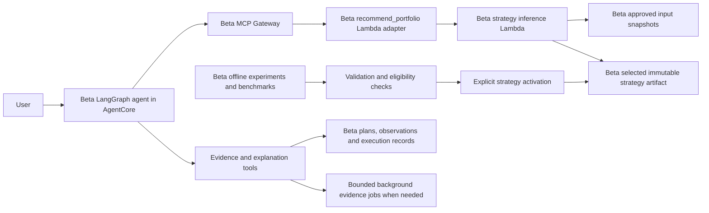
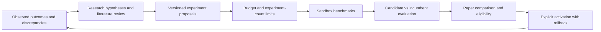

# Portfolio strategy lifecycle in beta

Beta is the only deployment stage in scope for the current work. A hosted, usable agent in beta
is the immediate deliverable; this does not require deploying gamma or prod. This document describes
the intended handoff being implemented in `serve-selected-strategy-via-mcp`, not a claim that its
deployed acceptance tests have passed. The later recurring research controller is a future phase.

## Four pipelines, one runtime system

| Pipeline / owner | Deploys | Interface to the other components |
|---|---|---|
| FinancialPlanning | Shared contracts, approved input snapshots, plans, publications and execution records | Versioned APIs, trusted artifact references and environment-scoped release manifests |
| FinanceModel | Offline jobs, evaluation, immutable research artifacts, strategy selection and allocation inference | Research-job API, selected-strategy Lambda and the selected artifact reference |
| FinanceLambdasTool | MCP Lambda adapters and their catalog | Stable tool names and validated request/response contracts |
| FinanceAgent | LangGraph runtime, AgentCore Gateway, authorization and skills | Authenticated user interaction and Gateway calls to registered tools |

The pipelines deploy services; they do not need to invoke each other for every user request.
All beta consumers resolve beta references under `/finplan/beta/…`. IAM, reference validation and
release checks enforce that scope. No beta service should depend on gamma/prod data, endpoints or
strategy selection. One-time sharing of research knowledge is different from a runtime dependency:
moving an artifact between environments would require an explicit verified promotion/copy.
Account-wide infrastructure is intentionally shared: the USD 50 budget and budget-state parameters
live under `/finplan/shared/financialplanning/…`; pipeline artifact stores, image repositories and
the versioned contracts registry are shared control-plane resources. Sharing these does not permit
beta to read gamma/prod workload data or use their selected strategies.

Initial release order is FinancialPlanning → FinanceModel → FinanceLambdasTool → FinanceAgent.
After that, compatible services release independently. Producer manifests expose the deployed
contract version; consumers use a pinned contracts package and verify producer compatibility.
The agent release registers the tool catalog's Lambda targets in its own Gateway.

## From an experiment to a recommendation

1. Freeze the input snapshot, universe, feature availability/timing, train/validation/test periods,
   constraints, costs, algorithm configuration and seeds before running an experiment.
2. Train and benchmark against controls and classical optimizers. Select on validation; reserve a
   genuinely untouched period for evaluation. Record failures and seed dispersion, not just the best seed.
3. Export the evaluated configuration without retraining. A learned strategy carries actor tensors,
   the exact observation/action transforms, seed aggregation, constraints and checksums. A classical
   strategy carries its frozen parameters and the serving implementation version.
4. Check serving parity, data coverage and eligibility. An export is not an automatic promotion.
   An explicit selected-strategy reference identifies the artifact, source experiment and configuration.
   The current PPO can be selected for beta advisory/paper use while remaining ineligible for production.
5. A recommendation request supplies an approved snapshot, decision date, current weights/cash,
   portfolio value and high watermark. Inference uses only information available at that decision time,
   applies the frozen constraints and returns weights, indicative buy/sell deltas and provenance.
6. The agent explains the deterministic result. It does not invent weights, treat realized backtest
   returns as a calibrated forecast, or infer that a recommendation executed in a brokerage account.

`recommend_portfolio` stays the same when switching between supported PPO, SAC and classical strategies.
Changing trained weights or supported optimizer parameters updates the selected artifact and reference.
Adding an unsupported algorithm or changing feature semantics requires a FinanceModel code release and
parity tests; a breaking public interface also requires a contracts/consumer release. The agent does
not need a new implementation for every model retraining.

The synchronous path is bounded: strategy Lambda 270 seconds, adapter backend read 280 seconds,
MCP target 300 seconds and agent MCP deadline 330 seconds. Training and large diagnostic/re-solve
jobs use the background job interface. No training occurs during an allocation request.

## Observe, explain, improve

Record each issued recommendation with its artifact/configuration, decision-time snapshot and
holdings. Record actual holdings, fills, cash flows, fees and valuation timestamps separately.
These anchors make it possible to distinguish strategy performance from execution and accounting.
Without an execution record, the agent can discuss a paper path but cannot assert an actual return.

The explanation workflow reconciles returns and explores discrepancies through evidence: input/data
availability, allocation changes, constraints, fees/slippage, execution delays, and model/market regime.
Controlled re-solves and sensitivity sweeps are modeled effects, not proof of real-world causation.
Expensive evidence work retains the existing bounded CPU-job design. Findings can propose research
hypotheses; they do not silently change the selected strategy.

The future recurring controller can close the loop:

This controller searches over modeling approaches as well as retraining parameters. It should keep
a reproducible candidate registry, literature citations, data timestamps, seed results, held-out
evaluation history, costs and rollback references. Repeatedly choosing winners on the same test
period turns it into validation; fresh evaluation windows and paper results are needed over time.
Research-agent proposals remain constrained by supported runners, explicit objective/risk criteria,
maximum jobs and spending. Future automatic activation would need a separately agreed policy.

No recurring research schedule is enabled by this change. The overall experimentation budget is
USD 50; the current serving/export verification round has an incremental USD 2 cap and does not
retrain. Before starting paid work, estimate it and check the remaining project allocation. Research
and infrastructure/API costs must both be accounted for; a training-cost estimate alone is insufficient.
